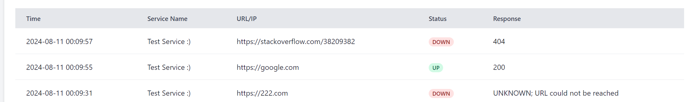

# Uptime-Checker

Supports Websites, Ports, and APIs(unauthenticated).

## Todos

- [x] Make UI Better
- [ ] Dockerfile
- [ ] Fix Known Bug

### 1 Known Bug :

This bug reverts to the old state of the website after the first check. This is because the website is not responding to the request. This is a known bug and will be hopefully fixed in the next update.
